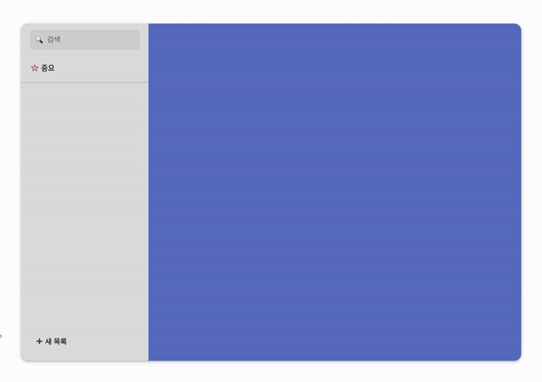
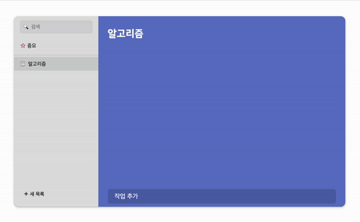
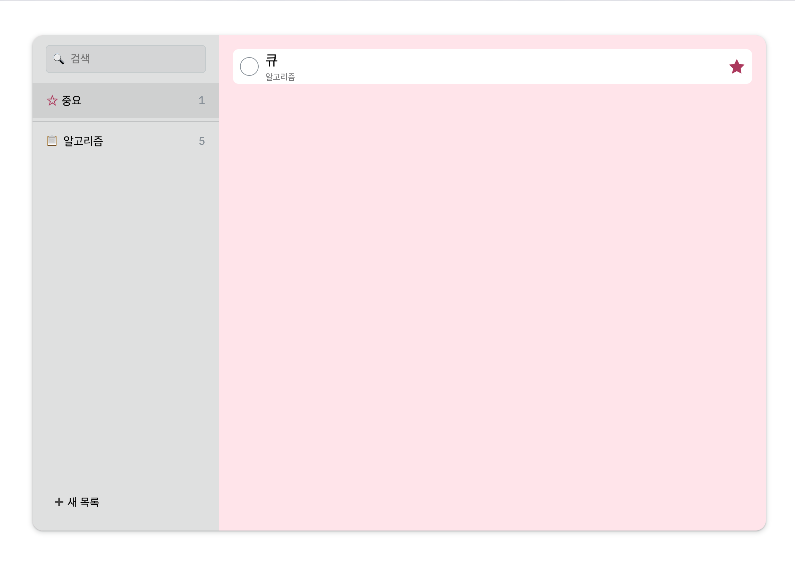
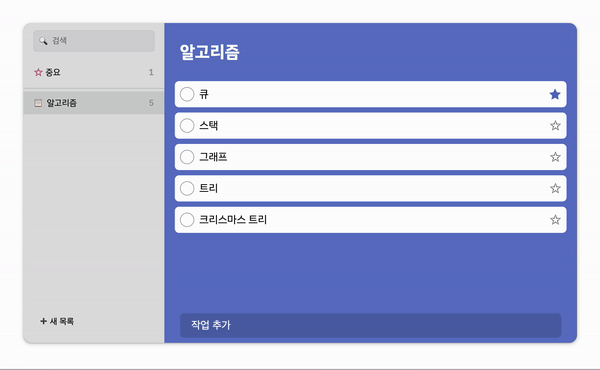

# Microsoft To Do App Clone Web
MicroSoft To Do App을 참조하여 만든 To Do List 페이지.

## Deployment
배포된 사이트는 아래에서 확인이 가능하다.
https://ms-todo-clone-ts.vercel.app/

## 실행
```bash
yarn start
yarn run json-server

# or

npm run start
```

## 주요 기능
### To Do Category


- 오른쪽 클릭, 혹은 더블 클릭으로 Context Menu 오픈
- 목록 메뉴 추가
- 목록 메뉴 이름 변경
- 목록 메뉴 삭제

### To Do

- To Do 추가
- To Do 삭제
- To Do 완료 체크
- To Do 중요 표시

### 중요


- To Do 목록 중 중요로 체크 한 것을 모아 봄

### 검색

- 모든 목록 중 입력 키워드의 To Do를 검색

### 반응형
